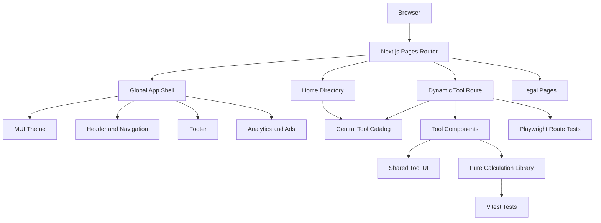
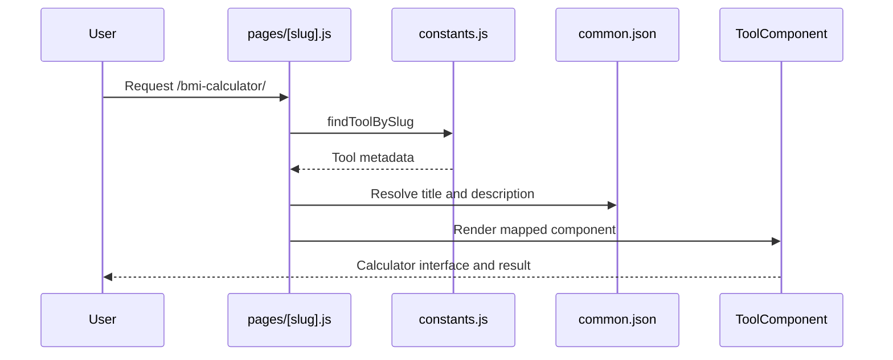
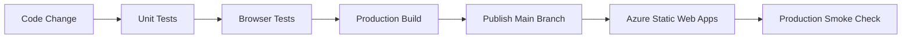

# WannaCalc Architecture

## Overview

WannaCalc is a statically generated Next.js website containing 49 calculators,
converters, generators, and text utilities. It uses the Pages Router, Material
UI, and English translations provided through `next-i18next`.

The application is designed around:

- Stable, human-readable tool URLs.
- A shared responsive interface for every tool.
- A central catalog for navigation, search, categories, and route generation.
- Pure calculation functions that can be tested separately from React.
- Static generation suitable for Azure Static Web Apps.

## Technology Stack

| Area | Technology |
| --- | --- |
| Framework | Next.js 15, Pages Router |
| UI | React 18, Material UI 5, Emotion |
| Localization | `next-i18next`, English locale |
| Calculation precision | Native JavaScript and `currency.js` |
| Date calculations | `moment` |
| Hash generation | `crypto-js` |
| Unit testing | Vitest |
| Browser testing | Playwright |
| Hosting | Azure Static Web Apps |
| Analytics | Google Analytics, Google Tag Manager, Vercel Analytics |

Node.js 18 or newer is required.

## High-Level Architecture



## Repository Structure

```text
.
├── components/
│   ├── Calculaters/        Calculator interfaces
│   ├── converters/         Unit conversion interfaces
│   ├── generators/         Random and text generators
│   ├── other/              Translators and utility tools
│   ├── Header.js           Global header and primary navigation
│   ├── BurgerMenu.js       Grouped tool navigation
│   ├── footer.js           Global footer
│   ├── ThreeColumnLayout.js
│   ├── Input.js
│   ├── CalcButtons.js
│   └── CopyToClipboardButton.js
├── lib/
│   ├── calculations.js     Pure formulas and validators
│   └── calculations.test.js
├── pages/
│   ├── _app.js             Theme, shell, analytics, and page composition
│   ├── _document.js        Document metadata, GTM, fonts, and AdSense
│   ├── index.js            Searchable tool directory
│   ├── [slug].js           Dynamic route for all tools
│   ├── privacy-policy.js
│   └── terms-of-use.js
├── public/
│   ├── locales/en/         English interface content
│   ├── sitemap.xml
│   ├── robots.txt
│   └── brand assets
├── scripts/
│   ├── generate-sitemap.mjs
│   └── generate-random-number.js
├── tests/e2e/              Playwright browser tests
├── constants.js            Tool catalog and category registry
├── theme.js                MUI design tokens and component defaults
├── next.config.js
├── next-i18next.config.js
├── middleware.js
├── playwright.config.js
└── vitest.config.mjs
```

`components/Calculaters` retains its historical spelling because existing
imports depend on that directory name.

## Application Shell

`pages/_app.js` composes every page in this order:

```text
ThemeProvider
├── CssBaseline
├── GoogleAnalytics
├── Header
│   └── Current page
├── Vercel Analytics
└── Footer
```

`theme.js` is the design-system source of truth. It defines:

- Brand and semantic colors.
- Responsive typography.
- Border radii and spacing behavior.
- Button, input, paper, and focus-state defaults.
- Global background and accessibility styling.

`Header.js`, `BurgerMenu.js`, `footer.js`, and `ThreeColumnLayout.js` provide
the responsive page shell. Tool pages place their content in
`ThreeColumnLayout`, which reserves desktop side columns for advertising while
keeping the tool interface centered and usable on mobile.

## Tool Catalog

`constants.js` is the central registry for the website's tools. It contains the
four category collections:

- `InternationalLinks` for calculators.
- `InternationalLinksConvertors` for converters.
- `InternationalLinksGenerators` for generators.
- `InternationalLinksOthers` for utility tools.

These collections are combined into:

- `toolGroups`, used for category navigation.
- `toolCatalog`, used by search, cards, static route generation, and tests.
- `findToolBySlug`, used to resolve route metadata.

Each catalog item defines:

```javascript
{
  en: "/percentage-calculator",
  icon: "percent",
  title: "percentage.title",
  type: "calculator"
}
```

The generated catalog also includes its category and normalized slug.

## Routing and Static Generation

The home page is implemented in `pages/index.js`. It reads `toolCatalog`,
translates tool titles, and filters tools by search text and category.

All tool URLs are handled by `pages/[slug].js`.



`getStaticPaths` generates every registered tool route during the production
build. Unknown slugs return a 404 because fallback routing is disabled.

Public slugs are treated as stable API-like identifiers. Renaming a component
must not silently change its published URL.

## Tool Component Pattern

Most tools follow this composition:

```text
ThreeColumnLayout
├── Title
├── Description
├── Inputs and controls
├── Validation feedback
├── Result display
│   └── CopyToClipboardButton
└── CalcButtons
```

Shared components provide:

- Unique and accessible input IDs.
- Responsive outlined inputs.
- Consistent calculate, convert, generate, and reset actions.
- Result announcements and clipboard feedback.
- Common page spacing, result styling, and mobile behavior.

Tool-specific React components own form state and presentation. Deterministic
business logic should be placed in `lib/calculations.js` instead of being
embedded in the component.

## Calculation Layer

`lib/calculations.js` contains pure functions for:

- Percentages and percentage changes.
- BMI and BMR.
- Loans and compound interest.
- SIP and CAGR calculations.
- Fuel cost, margin, discount, and tip calculations.
- Conversion and business rates.
- Salary calculations.
- Cat and dog age estimates.
- BTU capacity and room-area estimates.

The module validates finite numbers, positive ranges, zero divisors, and other
formula constraints. Invalid inputs throw `RangeError` instances. Components
catch these errors and present an inline Material UI alert.

Pure functions do not access React state, browser APIs, translations, or the
network. This keeps formulas deterministic and directly testable.

## Localization

`next-i18next.config.js` currently enables English only.

User-facing tool content is stored in:

```text
public/locales/en/common.json
```

Catalog titles contain translation keys rather than display strings. A tool
normally uses matching keys for its metadata:

```text
percentage.title
percentage.description
```

The project contains historical Bulgarian and Arabic files, but they are not
active locales and should not be treated as complete translations.

## SEO and Discovery

SEO behavior is split across:

- `pages/index.js` for home metadata.
- `pages/[slug].js` for translated tool metadata.
- `pages/privacy-policy.js` and `pages/terms-of-use.js` for legal metadata.
- `scripts/generate-sitemap.mjs` for sitemap generation.
- `public/robots.txt` for crawler discovery.

Canonical URLs use `https://wannacalc.com` and trailing slashes. The sitemap
contains the home page, legal pages, and all registered tools.

Run the following after adding or changing routes:

```bash
npm run sitemap
```

## Analytics and Advertising

Analytics and advertising are integrated at the shell level:

- Google Tag Manager and AdSense are configured in `pages/_document.js`.
- Google Analytics route tracking is handled by
  `components/GoogleAnalytics.js`.
- Vercel Analytics is mounted in `pages/_app.js`.
- Desktop advertising space is reserved by `ThreeColumnLayout.js`.

Core tool functionality must remain usable when analytics or advertising
scripts are blocked.

## Testing Strategy

### Unit tests

Vitest tests pure calculations and utility behavior:

```bash
npm run test
```

New formulas should include:

- Standard valid inputs.
- Zero and negative boundaries.
- Invalid numeric values.
- Division-by-zero cases.
- Expected precision and rounding.

### Browser tests

Playwright verifies:

- Home search and empty states.
- Every registered tool route.
- Absence of page-level runtime errors.
- Representative validation behavior.
- Bidirectional translators.
- Important conversion factors.

```bash
npm run test:e2e
```

### Full verification

```bash
npm run verify
```

This runs linting, unit tests, and the production build. Browser tests are run
separately because they start a local Next.js server.

## Deployment

The GitHub Actions workflow under `.github/workflows` deploys the project to
Azure Static Web Apps when the configured branch is published.

The release flow is:



Publishing is intentionally performed by the project owner. Before release,
follow the checklist in `README.md`.

## Adding a New Tool

1. Add the React component to the appropriate `components` category.
2. Add its translation strings to `public/locales/en/common.json`.
3. Register its slug, icon, title key, and type in `constants.js`.
4. Import and map the component in `pages/[slug].js`.
5. Move deterministic formulas into `lib/calculations.js`.
6. Add unit tests for the formula.
7. Regenerate the sitemap.
8. Run `npm run verify` and `npm run test:e2e`.

## Architectural Constraints

- The application intentionally remains on the Pages Router.
- Tool component routing still requires an entry in both `constants.js` and
  the `componentsBySlug` map in `pages/[slug].js`.
- Public slugs must remain stable to preserve search ranking and bookmarks.
- English is the only supported production locale.
- Browser-only APIs, including clipboard access, must be called from event
  handlers rather than during static generation.
- Calculation functions must remain deterministic and independent of React.
